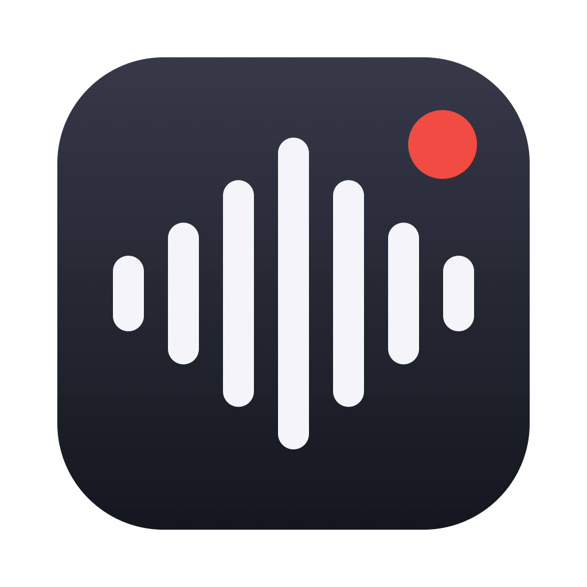
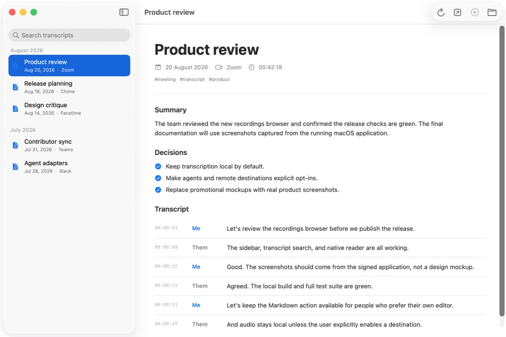
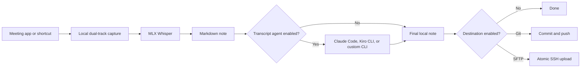

<div align="center">
  
  <h1>MeetScribe</h1>
  <p><strong>Local-first meeting capture for macOS, with agents and storage you control.</strong></p>
  <p>
    <a href="#build-from-source">Build from source</a>
    ·
    <a href="CONTRIBUTING.md">Contribute</a>
  </p>
  <p>
    <a href="https://github.com/alejacre/meetscribe/actions/workflows/ci.yml"></a>
    
    <a href="LICENSE"></a>
    
  </p>
</div>



_Real screenshot from the signed macOS application using fictional demo transcripts._

MeetScribe is an open source macOS menu bar app that records meetings, transcribes
them locally with MLX Whisper, optionally processes the Markdown with a CLI agent,
and publishes completed notes to storage you operate.

Local files are always written first. Agents, Git publishing, SFTP, and remote audio
export remain disabled until you configure them.

## Why MeetScribe

| Principle | What it means |
| --- | --- |
| **Local first** | Capture and transcription run on your Mac. No MeetScribe account or hosted transcript service. |
| **Agent agnostic** | Use no agent, Claude Code, Kiro CLI, or any executable that follows the Markdown stdin/stdout contract. |
| **Storage you control** | Keep notes in a normal folder, commit them to Git, or upload over SFTP using OpenSSH. |
| **Recoverable** | Versioned manifests preserve recording identity and retry state across failures and restarts. |
| **Inspectable** | The primary artifact is readable Markdown, with machine state stored in a private sidecar directory. |

## Core workflow



1. Choose `Ignore`, `Ask before recording`, or `Record automatically` per meeting app.
2. MeetScribe records microphone and system audio as separate tracks.
3. A locked MLX Whisper model transcribes both tracks locally.
4. The formatter produces timestamped `Me` and `Them` turns.
5. An optional transcript agent processes validated Markdown.
6. Optional Git and SFTP destinations publish after the local note is complete.

## Capabilities

- Configurable triggers for Zoom, Slack, Amazon Chime, Microsoft Teams, FaceTime,
  Webex, and custom macOS bundle identifiers.
- Native menu bar controls and a recordings browser with full-text search,
  summaries, decisions, timestamped turns, notifications, launch at login, and
  the `Option+Shift+R` global shortcut.
- Separate microphone and meeting-audio capture through ScreenCaptureKit.
- Locked and verified MLX Whisper model revisions for Apple Silicon.
- Claude Code adapter pinned to Haiku, with tools and session persistence disabled.
- Kiro CLI adapter with a temporary tool-free agent and automatic session cleanup.
- Generic command adapter with literal arguments, restricted environment, and
  structural output validation.
- Git publication with clean-worktree checks, scoped commits, and upstream push.
- Atomic SFTP publication through `/usr/bin/sftp` and the user's OpenSSH config.
- Persistent manifests for transcription and publication recovery.

## Build from source

Requirements:

- macOS 15 or later on Apple Silicon
- Xcode 16 or later with Swift 6
- [`uv`](https://docs.astral.sh/uv/) from Homebrew or a verified Astral package
- Screen Recording and Microphone permission

```bash
git clone https://github.com/alejacre/meetscribe.git
cd meetscribe
./build.sh
open build/MeetScribe.app
```

`build.sh` creates and verifies `build/MeetScribe.app`. It uses a local
`MeetScribe Dev Signing` identity when available and otherwise applies an ad-hoc
development signature. It never writes to `/Applications`; run `./install.sh`
explicitly to install the app.

The first-run assistant installs the pinned transcription engine through your
existing `uv`, verifies and downloads a locked model, requests macOS permissions,
selects an output folder, and offers explicit opt-in to Claude Code or Kiro CLI.

## Configure

### Meeting triggers

Open **Settings > Triggers**:

- **Ignore** never starts or prompts.
- **Ask before recording** sends an actionable notification.
- **Record automatically** starts while that app actively uses the microphone.

### Transcript agents

Open **Settings > Agent**:

- **None** keeps local Whisper output unchanged.
- **Claude Code** runs the local `claude` CLI with Haiku, tools and persistence disabled.
- **Kiro CLI** runs a temporary tool-free agent and deletes its local session afterward.
- **Custom command** runs any absolute executable without a shell.

The custom adapter receives Markdown on stdin and returns validated MeetScribe
Markdown on stdout. See [Agent adapters](docs/agent-adapters.md).

### Destinations

Open **Settings > Destinations**:

- **Git repository** copies selected artifacts, commits them, and pushes the current
  branch to its upstream.
- **SFTP over SSH** uses strict host checking, your OpenSSH authentication, a
  temporary remote directory, and atomic rename.

Audio export is off by default. See [Destinations](docs/destinations.md).

## Output format

```text
Recordings/
|-- 2026-08-20-project-review.md
`-- .assets/2026-08-20-project-review/
    |-- manifest.json
    |-- transcript.json
    |-- audio.m4a
    |-- mic.m4a
    `-- system.m4a
```

```markdown
---
date: 2026-08-20
attendees: []
tags: [meeting, transcript]
---

## Summary
Added by the configured transcript agent, when enabled.

## Transcript
[00:00:03] **Me:** Let's review the release plan.
[00:00:07] **Them:** The local build is green.
```

The [recording manifest](docs/recording-manifest.md) stores a stable UUID, source
application, trigger, lifecycle, transcript run, and per-destination publication
state.

## Privacy and security

- Audio and transcription are local by default.
- Recording assets and manifests use owner-only permissions.
- Transcript agents and remote destinations require explicit configuration.
- Enabled agents receive the complete transcript.
- Git and SFTP export Markdown, manifest, and transcript JSON; audio is separate
  opt-in.
- MeetScribe never stores SSH passwords or private keys.

You are responsible for obtaining any recording consent required by your
jurisdiction and organization. Report security issues through
[SECURITY.md](SECURITY.md), not a public issue.

## Architecture

The application uses typed configuration, persistent recording manifests,
transcript-agent adapters, and destination adapters. Start with
[Architecture](docs/architecture.md), then read:

- [Agent adapter contract](docs/agent-adapters.md)
- [Destination behavior](docs/destinations.md)
- [Manifest schema](docs/recording-manifest.schema.json)

## Development

```bash
swift build -Xswiftc -warnings-as-errors
scripts/run-tests.sh
scripts/check-coverage.sh
swift build -c release -Xswiftc -warnings-as-errors
scripts/check-docs.sh
```

CI enforces the production line coverage threshold defined by
`scripts/check-coverage.sh`, including per-file floors for critical operational
paths. Tests do not require real meeting audio, network credentials, or access
to an SFTP server. The Git integration test pushes only to a temporary local
bare repository.

## Contributing

Focused fixes and additions are welcome, especially:

- New meeting-app definitions
- Transcript-agent adapters
- Storage destinations
- Recovery, privacy, and accessibility improvements
- Tests and documentation

Read [CONTRIBUTING.md](CONTRIBUTING.md) before opening a pull request. Use
[SUPPORT.md](SUPPORT.md) for help and [CODE_OF_CONDUCT.md](CODE_OF_CONDUCT.md)
for community expectations.

## License

[MIT](LICENSE)
